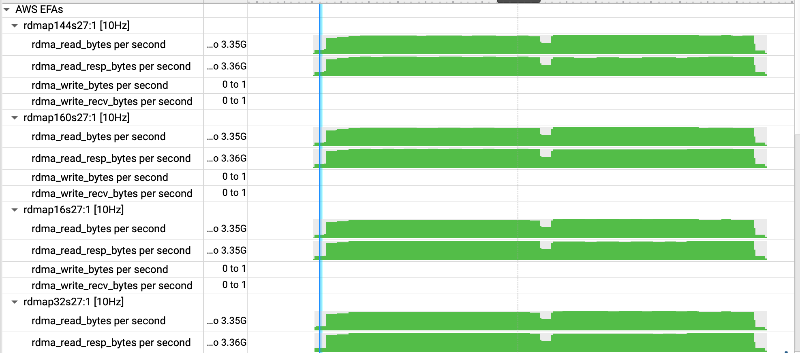
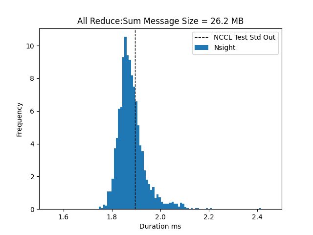
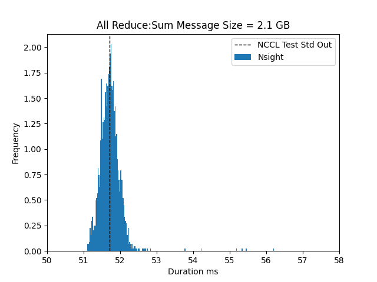

# NCCL All Reduce Test

In this section, we will analyze NCCL All Reduce Performance numbers with NVIDIA Nsight. This test is performed with the following parameters on a 2 node `p4de.24xlarge` cluster:

```
ARG GDRCOPY_VERSION=v2.4.1
ARG EFA_INSTALLER_VERSION=1.34.0
ARG AWS_OFI_NCCL_VERSION=v1.10.0-aws
ARG NCCL_VERSION=v2.22.3-1
ARG NCCL_TESTS_VERSION=v2.13.10

export NCCL_BUFFSIZE=8388608
export NCCL_P2P_NET_CHUNKSIZE=524288

all_reduce_perf -b 25M -e 25M -f 1 -g 1 -c 1 -n 100 -o sum
```
With this test we are doing 100 iterations of all reduce nccl test with message sizes of 25 MB and we get the following result:

```
 0: #                                                              out-of-place                       in-place
 0: #       size         count      type   redop    root     time   algbw   busbw #wrong     time   algbw   busbw #wrong
 0: #        (B)    (elements)                               (us)  (GB/s)  (GB/s)            (us)  (GB/s)  (GB/s)
 0:     26214400       6553600     float     sum      -1    2009.1  13.05   24.46      0    1873.9   13.99   26.23      0
 0: 
 0: # Out of bounds values : 0 OK
 0: # Avg bus bandwidth    : 25.3468
 0: #
```
This result looks very similar with a 1000 iterations:

```
 0: #                                                              out-of-place                       in-place
 0: #       size         count      type   redop    root     time   algbw   busbw #wrong     time   algbw   busbw #wrong
 0: #        (B)    (elements)                               (us)  (GB/s)  (GB/s)            (us)  (GB/s)  (GB/s)
 0:     26214400       6553600     float     sum      -1   1896.5   13.82   25.92      0   1873.1   14.00   26.24      0
 0:    
 0: # Out of bounds values : 0 OK
 0: # Avg bus bandwidth    : 26.0796
 0: #
```

We get a bandwidth of ~25 GB/s. Now we must answer the following questions:
1. Is this expected?
2. Did we use all 4 EFA devices?
3. The reported number is an average busbw. What is the variance?
4. Is the busbw consistent across different GPUs?

Let's dive deeper with a NVIDIA Nsight report:

1. We can see from the Nsight report that during this test we used all 4 EFA devices
2. Why do we see a RDMA read bytes/s at 3.35 GB/s which is the bandwidth for 1 GPU
3. We can also see that busbw is the same for different GPUs.
4. We can see `ncclDevKernel_AllReduce_Sum_f32_TREE_LL` CUDA kernels being used which tells us 4 things:
   * We use the `Sum` all reduce operation as specified in the srun command. 
   * We do this operation on float32 numbers
   * TREE
   * We use the LL NCCL Protocol
   * We use the `Tree` NCCL Algorithm
   * Choice of NCCL Protocol and Algorigthms could have a strong impact on performance especially at scale and is automatically selected by NCCL - https://developer.nvidia.com/blog/massively-scale-deep-learning-training-nccl-2-4/


<center> </br>
</center>

5. Finally, from the Nsight report, we can capture `durations` and estimate variance to be roughly about 5%.

<center> </br>
</center>

6. Does the variance increase as message size increases? Variance looks to be the same at 5%.

<center> </br>
</center>


Resources: https://github.com/stas00/ml-engineering/blob/master/network/benchmarks/all_reduce_bench.py

